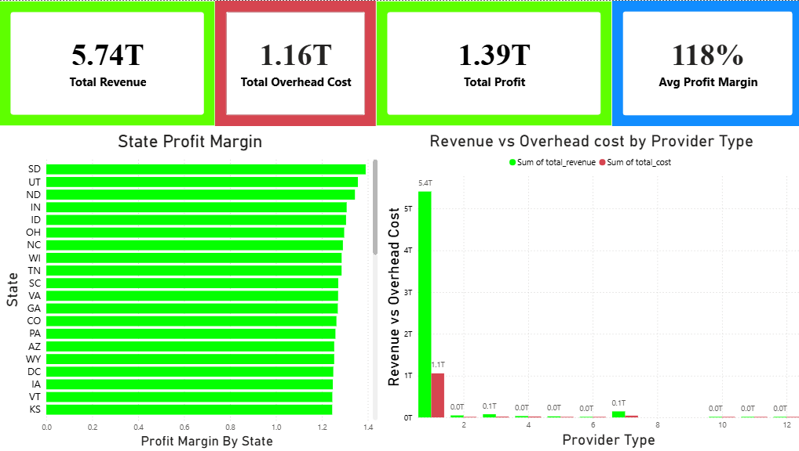
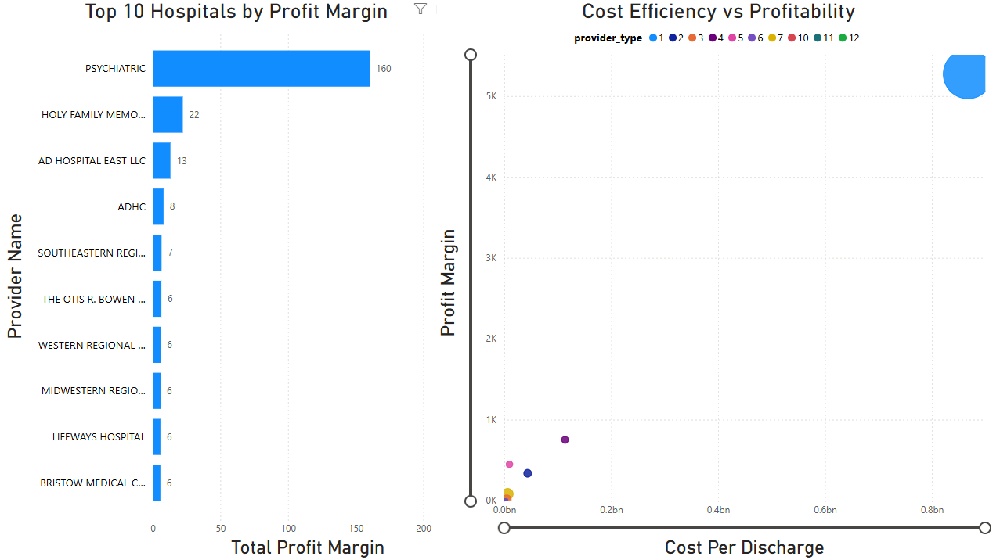
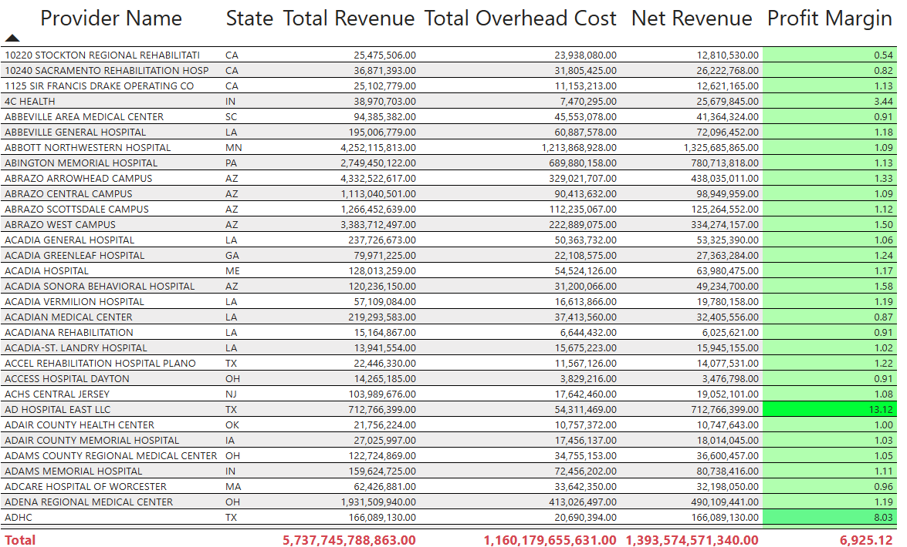
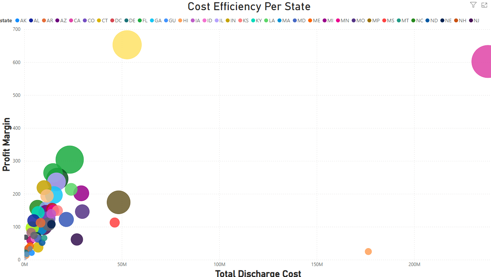

# Healthcare Financial Data Analysis (End-to-End ETL project)

## Overview 

### This project showcases an end-to-end data analytics workflow using real healthcare financial data acquired from healthdata.gov. 
The project includes data extraction, transformation, loading into PostgreSQL, advanced SQL analysis, and interactive dashboard Power BI visualization.

## Skiils Used

- Python (Pandas) --> Data Cleaning and Transformation
- PostgreSQL --> Data Storage and Querying
- SQL --> Advanced Data Analysis
- Power BI --> Data Visualization and Dashboarding

  ## ETL Pipeline

  ### The ETL pipeline was built using Python in Jupyter Notebook.

  1. Extraction
    - The dataset was pulled from HealthData.gov and was a CMS dataset
  2. Transform
    - Converted data types
    - Handled missing values
    - Created new columns:
        - Cost per Discharge
        - Charge-to-Cost Ratio
        - Profit Margin
    - Cleaned column names
  3. Load
    - Moved transformed data into PostgreSQL through Python and moved PostgreSQL data into PowerBI

  ## Database and SQL Analysis

  ### The dataset was stored in PostgreSQL and was analyzed using advanced SQL techniques such as:

    - Aggregations
    - CASE statements
    - CTEs
    - Windows functions
    - Filtering and grouping

  ## Power BI Dashboard

  ### There are four pages in the dashboard

 ### KPI 
  - Total Revenue, Total Overhead Cost, Total Profit, Average Profit Margin
  - Per State Profit Margin
  - Net Revenue from Total Revenue - Total Overhead Cost by Provider

### Provider Performance 
  - Top 10 Provider by Profit Margin
  - Comparing Provider Type cost efficiency through Profit Margin against Cost Per Discharge

### Detailed Hospital Table
  - Compares Multiple Fields for each Provider
  - A Table produces a sum of the total revenue, total overhead cost, net revenue, and profit margin
  - Uses conditional formatting for the table to visually see the highest profit margin via a gradient highlighting

### Comparative Analysis of Each State
  - List every state in a scatter plot with each bubble varying in size based on cost efficiency
  - Shows visually each state's cost efficiency based on all the providers within the state
  
 ## Sample Visualization of Dashboard
 
  

  

  

  

## Interactive Version 

 [View Interactive Dashboard on Power BI](https://westerngovernorsuniversity-my.sharepoint.com/:u:/g/personal/cbaldw21_wgu_edu/IQB8Ilm6bmCyTqndYhwX11eRAfXuviG2ijG-y_CQiwTcNJg?e=yNSvF0)

 ## How to Run the Project
1. Open the `.pbix` file in Power BI Desktop to view the dashboard interactively.  
2. Ensure that the included CSV files\ (`CostReport_2023_Final.csv`) are in the same folder as the `.pbix` file.
  
## Business Problem 

### Healthcare systems need to operate within a tight margin and rising costs. We need to see what providers
They are profitable but incur costs that are too high relative to the provider's revenue. Which provider types
are the most efficient, and financial performance across the United States to compare provider efficiency.

### Problems Addressed: 
  - Overspending
  - Discovering misallocation of resources
  - Uncovering inefficient facilities

### Solution
 - Building an end-to-end analytics solution to evaluate hospital performance
 - Clean and transform raw CMS data from HealthData.gov using Python
 - Store transformed data in PostgreSQL for analysis
 - Showcase advanced SQL to uncover trends, rankings, and profitability
 - Load transformed data into the Power BI dashboard to visualize insights

### Key Insights
  - Profitability can vary significantly by provider type, showing opportunities to focus on high-performance services
  - Different hospitals generate high revenue but can operate inefficiently, with costs being high compared to output
  - Cost per discharge is a strong indicator of inefficiency, as high cost can correlate to lower profit margins
  - Highest performance hospitals have lower costs while keeping high revenue, demonstrating operational efficiency compared to others
  - Certain states have higher profitability consistently, pointing to potential regional differences in healthcare

## Business Impact 
  - Finds underperforming hospitals and highlights their need for cost optimization
  - Benchmarks operational efficiency nationwide by cost per discharge
  - Focuses on high-margin provider types for investment and review
  - Supports data-driven budgeting, financial planning, and benchmarking
  - Finds inefficiencies leading to improve profitabiltiy 

  

   
